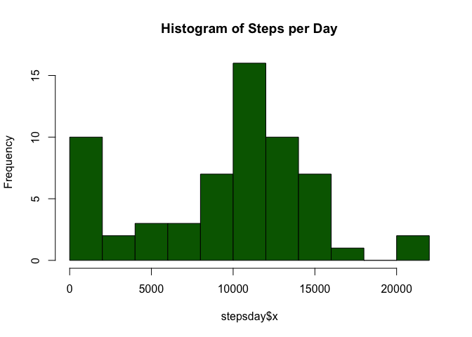
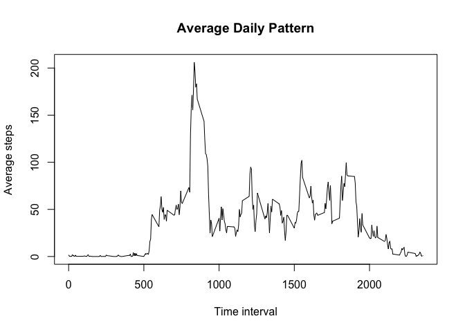
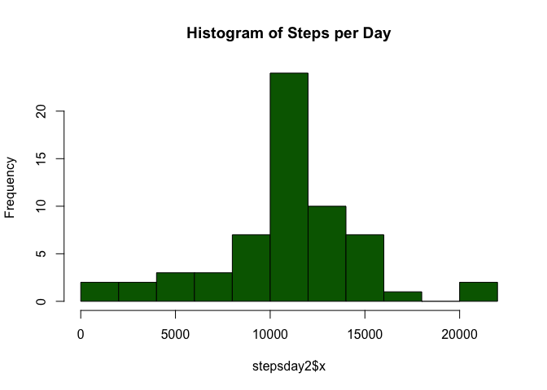
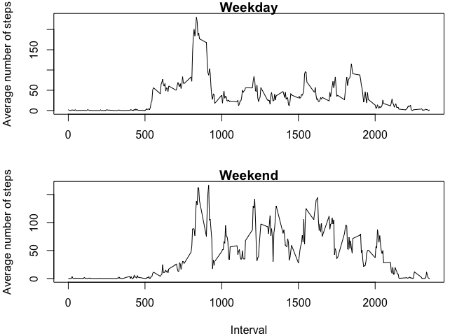

First I load all the packages neccesary.

```r
library(lubridate)
```

```
## 
## Attaching package: 'lubridate'
```

```
## The following object is masked from 'package:base':
## 
##     date
```

```r
library(dplyr)
```

```
## 
## Attaching package: 'dplyr'
```

```
## The following objects are masked from 'package:lubridate':
## 
##     intersect, setdiff, union
```

```
## The following objects are masked from 'package:stats':
## 
##     filter, lag
```

```
## The following objects are masked from 'package:base':
## 
##     intersect, setdiff, setequal, union
```


## Loading and preprocessing the data


This is the code to load the data and convert date to DATE.  


```r
activity <- read.csv("activity.csv", stringsAsFactors = FALSE)
activity$date <- ymd(activity$date)
```
  
## What is mean total number of steps taken per day?
First I  collapse the data using the *aggregate* function to find the
total number of steps per day.


```r
stepsday <- aggregate(activity$steps, by=(list(activity$date)), FUN=sum, na.rm=TRUE)
```

Then I create a histogram of the steps per day. And report the mean and median.

```r
hist(stepsday$x, breaks = 10, col = "darkgreen", main = "Histogram of Steps per Day")
```

<!-- -->

```r
mean(stepsday$x)
```

```
## [1] 9354.23
```

```r
median(stepsday$x)
```

```
## [1] 10395
```

**The mean is 9354.2295082. The median is 10395.**  
  
  

## What is the average daily activity pattern?

First it's neccesary collapse the data using the *aggregate* function to find 
the average number of steps per time interval. Then I plot the data.


```r
stepsinterval <- aggregate(activity$steps, by=(list(activity$interval)),
                           FUN=mean, na.rm=TRUE)

with(stepsinterval, plot(Group.1, x, type="l", xlab = "Time interval", 
                         ylab = "Average steps", main = "Average Daily Pattern"))
```

<!-- -->

To calculate the maximun I use the *which.max* function.

```r
stepsinterval$Group.1[which.max(stepsinterval$x)]
```

```
## [1] 835
```


## Imputing missing values
I first use the summary function to find which variables have missing values.


```r
summary(activity)
```

```
##      steps             date               interval     
##  Min.   :  0.00   Min.   :2012-10-01   Min.   :   0.0  
##  1st Qu.:  0.00   1st Qu.:2012-10-16   1st Qu.: 588.8  
##  Median :  0.00   Median :2012-10-31   Median :1177.5  
##  Mean   : 37.38   Mean   :2012-10-31   Mean   :1177.5  
##  3rd Qu.: 12.00   3rd Qu.:2012-11-15   3rd Qu.:1766.2  
##  Max.   :806.00   Max.   :2012-11-30   Max.   :2355.0  
##  NA's   :2304
```

Only steps has missing values (2304), so I can count only those.


```r
sum(is.na(activity$steps))
```

```
## [1] 2304
```

There are 2304 missing values.  

To impute the missing values, I will replace them by the mean of that interval
over all the days.  


```r
activity2 <- activity
for(i in 1:length(activity$steps)) {
    if(is.na(activity[i, 1])) {
        index <- i %% 288
        if(index == 0) {index <- 288}
        activity2[i,1] <- stepsinterval[index,2]
    } 
}

stepsday2 <- aggregate(activity2$steps, by=(list(activity2$date)), FUN=sum, na.rm=TRUE)


hist(stepsday2$x, breaks = 10, col = "darkgreen", main = "Histogram of Steps per Day")
```

<!-- -->

```r
mean(stepsday2$x)
```

```
## [1] 10766.19
```

```r
median(stepsday2$x)
```

```
## [1] 10766.19
```

**Both the mean and the median change and become 1.0766189\times 10^{4}.**  


## Are there differences in activity patterns between weekdays and weekends?

I first create a factor variable to see if the day is a weekday or a weekend.
Then I plot the average number of steps per interval using a panel plot.


```r
typeday <- vector()

for(i in 1:length(activity2$steps)) {
    day <- weekdays(activity2$date[i])
    if(day == "Saturday" || day == "Sunday") {
       typeday[i] <- "weekend"
    } else {
        typeday[i] <- "weekday"
    }
}

typeday <- as.factor(typeday)
activity2 <- cbind(activity2, typeday)


stepsinterval2 <- aggregate(activity2$steps, by=(list(activity2$interval, activity2$typeday)),
                           FUN=mean, na.rm=TRUE)


par(mfrow = c(2,1), mar=c(4,4,1,2))

with(filter(stepsinterval2, Group.2=="weekday"), plot(Group.1, x, type="l", main = "Weekday", xlab = "", ylab = "Average number of steps"))
with(filter(stepsinterval2, Group.2=="weekend"), plot(Group.1, x, type="l", main = "Weekend", xlab = "Interval", ylab = "Average number of steps"))
```

<!-- -->

We can see that there are significant differences between weekdays and weekends.
In general, the individual walks more on weekends.


